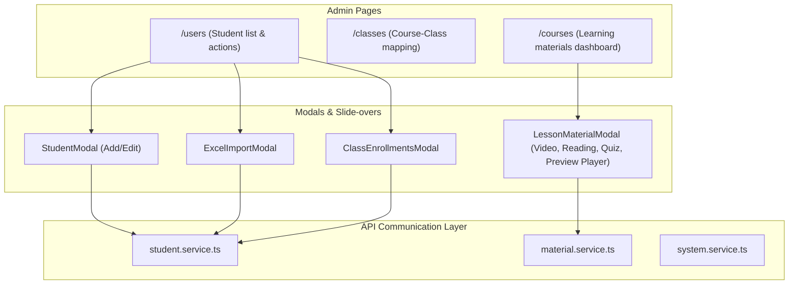

# Design Specification: Student Management & Learning Materials Integration

This document describes the technical architecture and UI design for implementing **Student Management (Admin/Staff)**, **Course-Class Management (Admin/Staff)**, and **Learning Materials Configuration (Admin/Staff with Embedded Student Preview Player)** in the `lms-portal-admin` project.

---

## 1. Architectural Overview & Data Flow

### Components & Routes Mapping
We will introduce three primary admin routes:
1. **`/users` (Student Management):** Replaces/maps the student list route.
2. **`/classes` (Course-Class Mapping):** Maps class administrative entities to courses and instructors.
3. **`/courses` (Learning Materials Configuration):** Tree view editor for Systems, Courses, Sessions, and Lessons, containing the lesson content editors and student player preview.

---

## 2. API Endpoints Integration

We will map the following endpoints from the specifications into our frontend services:

### Student Management & Class Enrollment
- `GET /v1/systems` $\rightarrow$ Lists systems for dropdowns.
- `GET /v1/students/report/by-system` $\rightarrow$ Fetches student overview report statistics.
- `GET /v1/students` $\rightarrow$ Fetches paginated student list (filters: `name`, `studentCode`, `systemId`, `studentStatusSearch`).
- `GET /v1/students/:id` $\rightarrow$ Fetches single student details.
- `POST /v1/students` $\rightarrow$ Creates a student.
- `PUT /v1/students/:id` $\rightarrow$ Updates student (supports multipart/form-data for avatar upload).
- `DELETE /v1/students/:id` $\rightarrow$ Deletes a student.
- `POST /v1/students/import/:systemId` $\rightarrow$ Excel bulk upload (multipart/form-data with file).
- `GET /v1/staff/student-classes/student/:studentId` $\rightarrow$ Gets enrolled classes for a student.
- `POST /v1/staff/student-classes` $\rightarrow$ Enrolls a student in a class.
- `PUT /v1/staff/student-classes/:id` $\rightarrow$ Updates enrollment status/active flag.
- `DELETE /v1/staff/student-classes/:id` $\rightarrow$ Disenrolls student from class.
- `GET /v1/staff/classes` $\rightarrow$ Lists all classes.

### Course-Class Management
- `POST /v1/staff/course-classes` $\rightarrow$ Maps a course + teacher + TA to a class.
- `GET /v1/staff/course-classes/class/:classId` $\rightarrow$ Lists mapped courses/teachers for a class.
- `PUT /v1/staff/course-classes/:id` $\rightarrow$ Updates course-class mapping (e.g. change teacher, status, dates).
- `DELETE /v1/staff/course-classes/:id` $\rightarrow$ Deletes course-class mapping.

### Learning Materials
- `GET /v1/staff/courses/system/:systemId` $\rightarrow$ Lists courses under a system.
- `GET /v1/staff/sessions/course/:courseId` $\rightarrow$ Lists sessions of a course.
- `POST /v1/staff/sessions` $\rightarrow$ Creates session.
- `GET /v1/staff/lessons/session/:sessionId` $\rightarrow$ Lists lessons under a session.
- `POST /v1/staff/lessons` $\rightarrow$ Creates a lesson.
- `POST /v1/staff/lessons/:id/video` $\rightarrow$ Uploads video metadata, video file/link, and embedded questions.
- `POST /v1/staff/lessons/:id/reading` $\rightarrow$ Uploads reading markdown/rich text, PDF file/link, and reading questions.
- `PUT /v1/staff/lessons/:id/quiz` $\rightarrow$ Links a quiz to a lesson.
- `GET /v1/staff/quizzes` $\rightarrow$ Lists quizzes for the selection dropdown.
- `GET /v1/staff/lessons/:id` $\rightarrow$ Fetches full lesson entity.

---

## 3. UI Component Details & Specifications

### 3.1. Student List & Statistics Page (`/users`)
- **Top Metrics Panel:** Displays HSL-tailored colored cards summarizing total students grouped by system and status (`ĐANG HỌC`, `BẢO LƯU`, etc.) fetched from `/v1/students/report/by-system`.
- **Search Grid:** A standard card layout enclosing filter dropdowns and search inputs. It dynamically triggers a React Query fetch on value changes.
- **Actions Menu:** Each table row includes:
  - Edit Details
  - Class Enrollments (opens `ClassEnrollmentsModal`)
  - Delete Student (shows deletion warning popup)

### 3.2. Student Forms (`StudentFormModal`, `ExcelImportModal`, `ClassEnrollmentsModal`)
- **`StudentFormModal`:** Form for creating and editing students. If editing, it uses `FormData` with a `multipart/form-data` request header when an avatar file is modified. Includes a multi-select dropdown for `systemIds` using React Hook Form.
- **`ExcelImportModal`:** User selects a `systemId`, then drags/drops a `.xlsx` file. Displays response success metrics (`inserted` and `updated` counts).
- **`ClassEnrollmentsModal`:** Displays active/inactive enrollment items in a list. Features a small expandable inline form to search classes, pick a status, and enroll the student.

### 3.3. Learning Materials Curriculum Editor (`/courses`)
- **System and Course selection:** A splitscreen/sidebar layout allowing quick traversal.
- **Nested Curriculum Accordion:** Sessions are expandable headers. Each contains a list of lessons. Features clean "+ Add Session" and "+ Add Lesson" quick-buttons.
- **`LessonMaterialModal` Tabs:**
  1. **Video Tab:** Supports file upload or pasting direct video URL. Displays form array for embedded questions containing `timeInVideo` (seconds), question text, option choices, and correctness checkbox.
  2. **Reading Tab:** Renders markdown input field, PDF file selector, and form array for reading questions.
  3. **Quiz Tab:** A dropdown selector of all quizzes retrieved via `GET /v1/staff/quizzes`.
  4. **Student Player Preview Tab:** Embeds a simulated client view. If lesson has a video, it renders a custom video player. It registers the time track and prompts a locking modal questions block at `timeInVideo` moments, mirroring the student study flow.

---

## 4. Testing & Verification Plan

### Automated Verification
- Verify routing rules in `next.config.ts` rewrite endpoints properly.
- Run build verification using `npm run build` to ensure typescript compilation passes.

### Manual Verification
- Launch local development server.
- Test student list pagination, system statistics, and student creation.
- Perform spreadsheet mock import.
- Perform lesson session creation and video questions insertion. Test player preview to ensure question modal triggers at set times.
