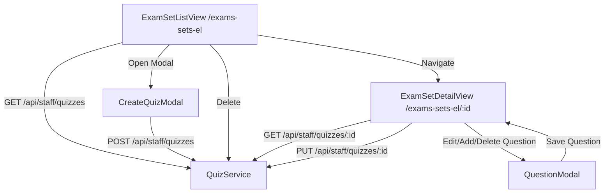

# Quiz Creation API Integration Design Document

**Date:** 2026-08-07  
**Topic:** Tích hợp API Luồng Tạo & Quản lý Bộ Đề Trắc Nghiệm (Quiz) vào `lms-portal-admin`  
**Reference Doc:** `file:///c:/Users/Admin/Desktop/lmsPortal/lms-portal-api/docs/quiz_creation_api_docs.md`

---

## 1. Overview & Objective

Triển khai tích hợp các API quản lý Quiz từ Backend (`lms-portal-api`) vào màn hình **Quản lý bộ đề trắc nghiệm (`/exams-sets-el`)** trong Frontend Admin (`lms-portal-admin`). Thay thế toàn bộ dữ liệu MOCK hiện tại bằng dữ liệu thực từ backend REST API.

---

## 2. API Endpoints & Data Transfer Objects (DTOs)

### Endpoints (Base URL: `/api/staff/quizzes`)
- `GET /api/staff/quizzes` (Query: `courseId` optional) -> Danh sách Quizzes.
- `GET /api/staff/quizzes/:id` -> Chi tiết Quiz (bao gồm mảng `questions`).
- `POST /api/staff/quizzes` -> Tạo mới Quiz.
- `PUT /api/staff/quizzes/:id` -> Cập nhật Quiz & ghi đè mảng `questions`.
- `DELETE /api/staff/quizzes/:id` -> Xóa Quiz.

### Data Schemas

```ts
export interface QuizOptionDto {
    content: string;
    isCorrect: boolean;
}

export type QuestionType = "SINGLE_CHOICE" | "MULTIPLE_CHOICE" | "TEXT";

export interface QuizQuestionDto {
    content: string;
    type: QuestionType;
    points?: number;
    options?: QuizOptionDto[];
    timeInVideo?: number;
}

export interface QuizBackendEntity {
    id: string;
    title: string;
    description?: string;
    passThreshold: number;
    courseId?: string;
    questions: Array<{
        _id?: string;
        content: string;
        type: QuestionType;
        points?: number;
        timeInVideo?: number;
        options?: Array<{
            _id?: string;
            content: string;
            isCorrect?: boolean;
        }>;
    }>;
    createdAt: string;
}

export interface CreateQuizPayload {
    title: string;
    description?: string;
    passThreshold?: number;
    courseId?: string;
    questions: QuizQuestionDto[];
}

export interface UpdateQuizPayload {
    title?: string;
    description?: string;
    passThreshold?: number;
    courseId?: string;
    questions?: QuizQuestionDto[];
}
```

---

## 3. Data Mapping & UI Compatibility

Để duy trì giao diện UI hiện có (`ExamSetListView`, `ExamSetDetailView`, `QuestionModal`), ta sẽ xây dựng mapper giữa `QuizBackendEntity` và UI model (`ExamSetMock` / `QuestionMock`):

1. **Backend -> UI (`mapBackendQuizToExamSet`)**:
   - `QuizBackendEntity.id` -> `ExamSetMock.id`
   - `QuizBackendEntity.title` -> `ExamSetMock.name`
   - `QuizBackendEntity.questions` -> `QuestionMock[]`
     - Backend question `content` -> UI `q.explanation` & `q.text`
     - Backend question `type` -> suy ra `isMulti` (`MULTIPLE_CHOICE` vs `SINGLE_CHOICE`)
     - Backend options (`content`, `isCorrect`) -> UI options (`id`, `label`, `text`, `isCorrect`)
2. **UI -> Backend Payload (`mapUiQuestionsToBackendDtos`)**:
   - Chuyển mảng `QuestionMock[]` từ UI modal/view thành `QuizQuestionDto[]`:
     - Nếu `isMulti` hoặc số đáp án đúng > 1 -> `type: "MULTIPLE_CHOICE"`
     - Nếu là tự luận hoặc không có options -> `type: "TEXT"`
     - Ngược lại -> `type: "SINGLE_CHOICE"`
     - Maps options -> `{ content: opt.text, isCorrect: opt.isCorrect }`

---

## 4. Proposed Architecture & Component Flow



### Components to Create / Modify:

1. **`src/constants/api-endpoints.constants.ts`**:
   - Thêm `QUIZ: { BASE: "${API_PREFIX}/staff/quizzes", DETAIL: (id) => "${API_PREFIX}/staff/quizzes/${id}" }`.

2. **`src/types/quiz.types.ts`**:
   - Khai báo DTOs backend & Payload interfaces.

3. **`src/services/quiz.service.ts`**:
   - Chứa các hàm `getQuizzes`, `getQuizById`, `createQuiz`, `updateQuiz`, `deleteQuiz`.

4. **`src/components/application/modals/create-quiz-modal.tsx`** [NEW]:
   - Modal tạo mới Quiz (Title, Description, PassThreshold, CourseId).

5. **`src/views/exams-sets/exam-set-list-view.tsx`**:
   - Kết nối `quiz.service` lấy danh sách thật.
   - Thêm nút "Tạo bộ đề mới" mở `CreateQuizModal`.
   - Nút Xóa bộ đề gọi API `deleteQuiz`.

6. **`src/views/exams-sets/exam-set-detail-view.tsx`**:
   - Kết nối `quiz.service` lấy chi tiết bộ đề theo `id`.
   - Khi người dùng Thêm/Sửa/Xóa câu hỏi -> Cập nhật danh sách câu hỏi local và đồng bộ lên backend bằng `PUT /api/staff/quizzes/:id`.

---

## 5. Verification Plan

1. **Automated Verification**:
   - Khởi chạy dev server (`npm run dev`) và kiểm tra không có lỗi build/TypeScript.
2. **Manual Verification**:
   - Truy cập `/exams-sets-el`.
   - Kiểm tra danh sách bộ đề từ API backend.
   - Thử bấm "Tạo bộ đề mới", nhập dữ liệu và submit -> Kiểm tra bộ đề được tạo thành công và xuất hiện ở danh sách.
   - Click xem chi tiết `/exams-sets-el/[id]`.
   - Thêm/chỉnh sửa câu hỏi trắc nghiệm -> Kiểm tra API `PUT /staff/quizzes/:id` được gọi thành công và lưu lại đúng.
   - Thử xóa bộ đề -> Kiểm tra bộ đề bị xóa khỏi danh sách.
